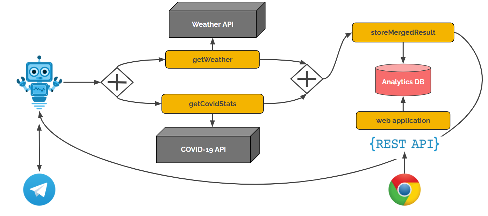

# Quarkus vs Spring Boot - Microservice Frameworks for Java

This repository contains all sources and slides to replay the Tutoring-Session *Quarkus vs Spring Boot - Microservice Frameworks for Java*.

## System Context of Bot Demo



## Prerequisites

* Unrestricted Internet Access for Maven usage
* Local IDE installation, eg. IntelliJ or Eclipse (optional). You can download IntelliJ CE here: https://www.jetbrains.com/idea/download/
* Java 11+ (might be included in IDE)
* Maven 3+ (might be included in IDE)

## Setup

* Add API and Bot keys for Telegram and OpenWeatherAPI to `application.properties`

```
telegram.token=SET_TELEGRAM_TOKEN
weather.token=SET_OPENWEATHERAPI_TOKEN
```

## Run Quarkus Bot Demo

* Change to `quarkus` folder
* Run `mvn quarkus:dev`

## Run Spring-Boot Bot Demo

* Change to `spring-boot` folder
* Run `mvn spring-boot:run`
